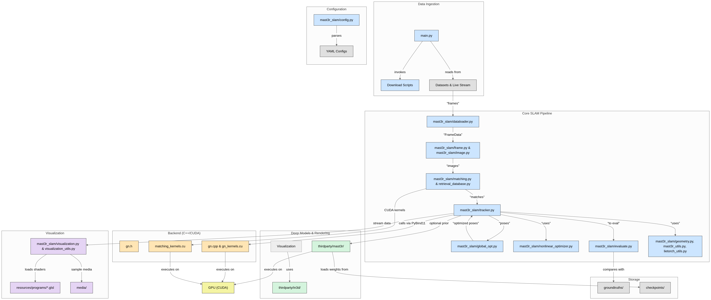

# MASt3R-SLAM: Real-Time Dense SLAM with 3D Reconstruction Priors

# Repository Workflow
<p align="center">
    
</p>
<br>

# Getting Started
## Installation
```
conda create -n mast3r-slam python=3.11
conda activate mast3r-slam
```
Check the system's CUDA version with nvcc
```
nvcc --version
```
Install pytorch with **matching** CUDA version following:
```
# CUDA 11.8
conda install pytorch==2.5.1 torchvision==0.20.1 torchaudio==2.5.1  pytorch-cuda=11.8 -c pytorch -c nvidia
# CUDA 12.1
conda install pytorch==2.5.1 torchvision==0.20.1 torchaudio==2.5.1 pytorch-cuda=12.1 -c pytorch -c nvidia
# CUDA 12.4
conda install pytorch==2.5.1 torchvision==0.20.1 torchaudio==2.5.1 pytorch-cuda=12.4 -c pytorch -c nvidia
```

Clone the repo and install the dependencies.
```
git clone https://github.com/rmurai0610/MASt3R-SLAM.git --recursive
cd MASt3R-SLAM/

# if you've clone the repo without --recursive run
# git submodule update --init --recursive

pip install -e thirdparty/mast3r
pip install -e thirdparty/in3d
pip install --no-build-isolation -e .
 

# Optionally install torchcodec for faster mp4 loading
pip install torchcodec==0.1
```

Setup the checkpoints for MASt3R and retrieval.  The license for the checkpoints and more information on the datasets used is written [here](https://github.com/naver/mast3r/blob/mast3r_sfm/CHECKPOINTS_NOTICE).
```
mkdir -p checkpoints/
wget https://download.europe.naverlabs.com/ComputerVision/MASt3R/MASt3R_ViTLarge_BaseDecoder_512_catmlpdpt_metric.pth -P checkpoints/
wget https://download.europe.naverlabs.com/ComputerVision/MASt3R/MASt3R_ViTLarge_BaseDecoder_512_catmlpdpt_metric_retrieval_trainingfree.pth -P checkpoints/
wget https://download.europe.naverlabs.com/ComputerVision/MASt3R/MASt3R_ViTLarge_BaseDecoder_512_catmlpdpt_metric_retrieval_codebook.pkl -P checkpoints/
```

## Examples
```
bash ./scripts/download_tum.sh
python main.py --dataset datasets/tum/rgbd_dataset_freiburg1_room/ --config config/calib.yaml
```
## Live Demo
Connect a realsense camera to the PC and run
```
python main.py --dataset realsense --config config/base.yaml
```
## Running on a video
Our system can process either MP4 videos or folders containing RGB images.
```
python main.py --dataset <path/to/video>.mp4 --config config/base.yaml
python main.py --dataset <path/to/folder> --config config/base.yaml
```
If the calibration parameters are known, you can specify them in intrinsics.yaml
```
python main.py --dataset <path/to/video>.mp4 --config config/base.yaml --calib config/intrinsics.yaml
python main.py --dataset <path/to/folder> --config config/base.yaml --calib config/intrinsics.yaml
```

## Downloading Dataset
### TUM-RGBD Dataset
```
bash ./scripts/download_tum.sh
```

### 7-Scenes Dataset
```
bash ./scripts/download_7_scenes.sh
```

### EuRoC Dataset
```
bash ./scripts/download_euroc.sh
```
### ETH3D SLAM Dataset
```
bash ./scripts/download_eth3d.sh
```

## Running Evaluations
All evaluation script will run our system in a single-threaded, headless mode.
We can run evaluations with/without calibration:
### TUM-RGBD Dataset
```
bash ./scripts/eval_tum.sh 
bash ./scripts/eval_tum.sh --no-calib
```

### 7-Scenes Dataset
```
bash ./scripts/eval_7_scenes.sh 
bash ./scripts/eval_7_scenes.sh --no-calib
```

### EuRoC Dataset
```
bash ./scripts/eval_euroc.sh 
bash ./scripts/eval_euroc.sh --no-calib
```
### ETH3D SLAM Dataset
```
bash ./scripts/eval_eth3d.sh 
```

<p align="center">
    
</p>
